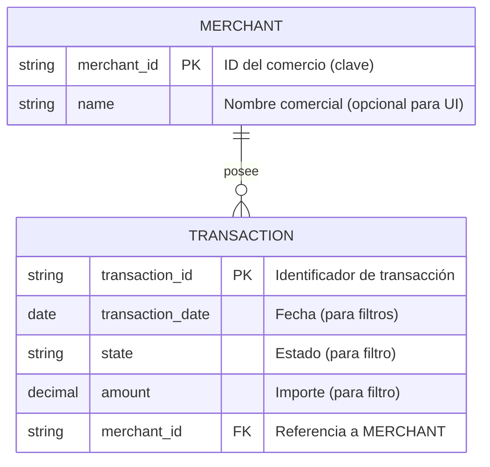

# ERD lógico — Historial de transacciones (LegacyPay)

## Supuestos
- El ERD incluye solo los campos mínimos necesarios para filtros y visualización: `transaction_date`, `state`, `amount`, `transaction_id` y la referencia a `merchant_id` (tomados de `docs/prd/PRD.md`).
- Se asume la existencia de un identificador de comercio (`merchant_id`) que permite delimitar el scope de consulta (no implica que la autorización esté implementada en la DB).
- No se agregaron tablas ni campos adicionales sin marcarlos como propuesta.
- PROPOSAL: mostrar `masked_pan_last4` (últimos 4 dígitos) es una propuesta posible para la UI, pero NO está incluida en el ERD hasta aprobación.

## Preguntas abiertas
- PREGUNTA ABIERTA: ¿Qué valores concretos de `state` (estados de transacción) deben soportarse como filtro? (ej. `APPROVED`, `DECLINED`, `PENDING`)
- PREGUNTA ABIERTA: ¿Qué campos mínimos exactos deben mostrarse en la interfaz para cada transacción además de los ya listados?
- PREGUNTA ABIERTA: ¿Se requiere incluir en BD algún campo para soporte de paginación (ej. cursor/offset) o se gestionará en la capa API sin cambios en el esquema lógico?
- PREGUNTA ABIERTA: ¿Se desea permitir mostrar información de método de pago (ej. `masked_pan_last4`) como dato visible en la UI? Si sí, requeriría aprobación y diseño de privacidad.
- PREGUNTA ABIERTA: ¿Existen requisitos de auditoría o registro de acceso que deban reflejarse en el modelo (tablas/relaciones de logs) o se tratarán como sistema aparte?
