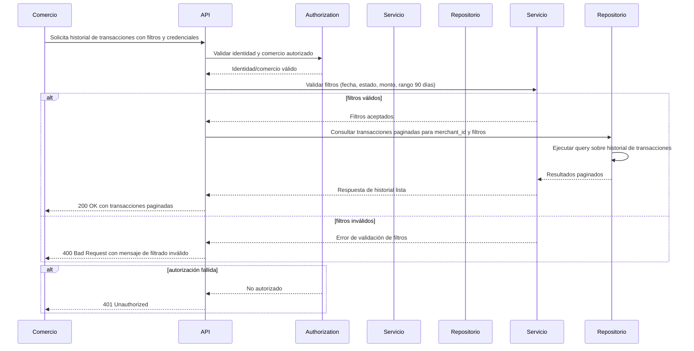

# Diagrama de secuencia — Consulta de historial de transacciones

## Auditoría

- La autorización ocurre antes de consultar datos? Sí. El flujo lleva la validación de identidad y comercio al componente `Authorization` antes de que el servicio consulte el repositorio.
- ¿Cada participante está justificado? Sí. Se incluyen solo los participantes necesarios: `Comercio` (actor autorizado), `API` (puerta de entrada), `Authorization` (control de acceso), `Servicio` (caso de uso/servicio de dominio) y `Repositorio` (acceso a datos).
- ¿El orden de mensajes es coherente? Sí. Primero se valida autorización, luego se validan filtros, luego se consulta el repositorio y finalmente se devuelve la respuesta.
- ¿Existe al menos un flujo de error? Sí. Hay un flujo alternativo para validación de filtros inválidos y otro para autorización fallida.
- ¿Coincide con el PRD y el ERD? Sí. El PRD exige comercio autorizado, filtros de fecha/estado/monto, paginación y datos no sensibles. El ERD muestra `TRANSACTION` asociado a `MERCHANT`; el repositorio consulta transacciones vinculadas a `merchant_id`.
- ¿El diagrama renderiza? El código Mermaid está estructurado como un bloque válido de `sequenceDiagram` y debe renderizar en visualizadores compatibles.

## Supuestos

- La validación de identidad y comercio usa un componente separado (`Authorization`) para dejar claro que la autorización es previa a cualquier consulta de datos.
- La paginación se maneja en el repositorio y el servicio devuelve resultados ya paginados al `API`.
- No se representan datos sensibles ni campos de tarjeta completos, solo la validación de acceso y filtros.

## Preguntas abiertas

- PREGUNTA ABIERTA: ¿El token/credenciales llegan en el mismo request que los filtros o hay un flujo de sesión separado?
- PREGUNTA ABIERTA: ¿La verificación de `merchant_id` contra el comercio autenticado se realiza en `Authorization` o también en `Servicio`?
- PREGUNTA ABIERTA: ¿Se requiere un flujo de error específico para consultas fuera del rango de 90 días, distinto del error general de filtros inválidos?
